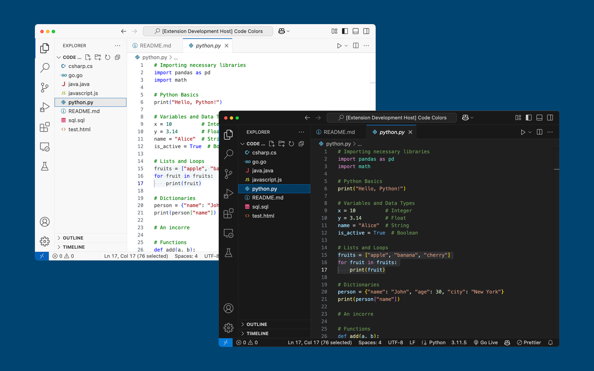

# LinkedIn Learning VS Code Theme (Lignt/Dark)

Accessible light and dark variant theme for VS Code created to improve accessibility when displaying code in LinkedIn Learning courses and in GitHub Codespaces. The dark variant is the default theme used for LinkedIn Learning exercise files and Codespaces.

These themes feature higher color contrast than VS Code’s default Dark and Light themes, meeting AAA WCAG standards.

## Install

1. Go to [VS Marketplace](https://marketplace.visualstudio.com/items?itemName=linkedinlearning.linkedinlearning-vscode-theme).
2. Click on the "Install" button.
3. Then [select a theme](https://code.visualstudio.com/docs/getstarted/themes#_selecting-the-color-theme). The options are:
   - `LinkedIn Learning Dark (Default)`
   - `LinkedIn Learning Light`
